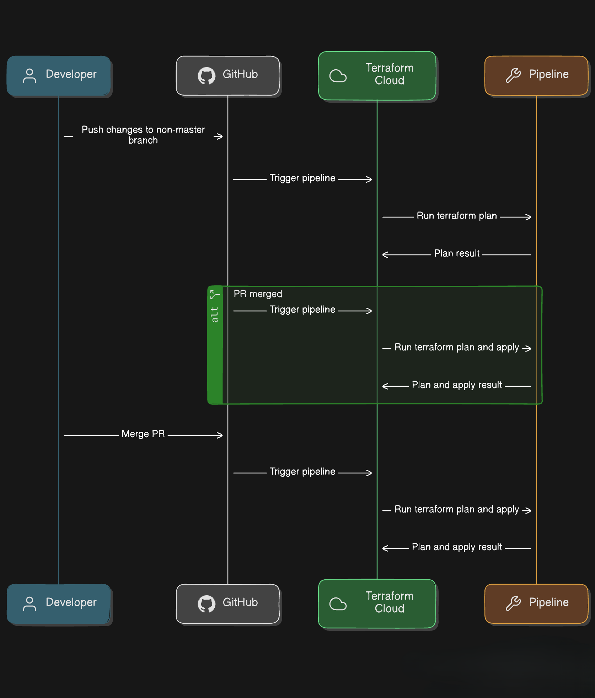

## This project is for setting up gitops approach for terraform using terraform cloud

In the evolving landscape of DevOps and cloud infrastructure management, adopting a GitOps approach can significantly streamline and enhance your operational workflows.

By leveraging Git as the single source of truth for your infrastructure configurations and automating the deployment process with tools like Terraform and Terraform Cloud, you can achieve a more reliable, transparent, and efficient infrastructure management system.

All infrastructure and application configurations are described declaratively. For example, Terraform configuration files (HCL) define the desired state of your infrastructure resources, such as VMs, networks, and storage.

Changes to the infrastructure are proposed through pull requests (PRs). This ensures that every change is reviewed, discussed, and approved by team members before being merged into the main branch, promoting collaborative development and high-quality code.

Once changes are merged into the main branch, they are automatically applied to the infrastructure using tools like Terraform Cloud. This automation ensures that the infrastructure's actual state is always consistent with the desired state defined in Git.

The CICD pipeline diagrammatic representation  --->

